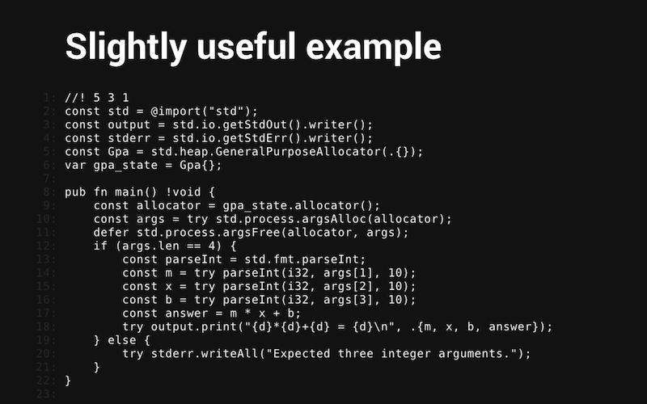

# Zig Presentation
Create interactive presentations/slide decks with a simple markup text file.

# How to build and run.
Uses a build.zig as the build process. In your terminal use command `zig build`, then `zig-out/bin/zig-presentation presentation.md` to run.

Alternatively you can use command `zig build run -- presentation.md`.

Read `presentation.md` for how to create a presentation file.

# Dependencies
- Zig 0.11.0-dev.3323+
- Glfw 3.x (included in lib)
- Nanovg-zig (included in lib)

# Optional Dependencies
- Ultralight (html renderer) (https://ultralig.ht/)
  - Add shared libraries to `lib/ultralight/`.
  - Add ultralight resources folder to `./`.
  - Use flag `-Dultralight=true` when compiling.